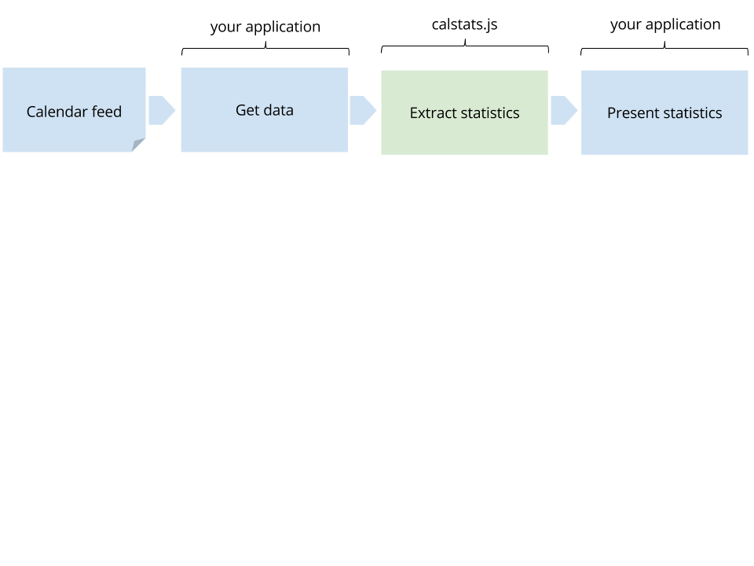

[ ](https://travis-ci.org/radify/calstats.js)
[ ](https://www.npmjs.com/package/calstats.js)
[ ](https://david-dm.org/radify/calstats.js)
[ ](https://david-dm.org/radify/calstats.js#info=devDependencies)

# calstats.js

JavaScript tool that can generate statistics for calendars by parsing `[tags]`. Provides:

* Amount of time spent on each client
* Detailed breakdown of tasks within projects
* Total time spent
* Count of events
* "Tree" of the calendar data

This library has adapters for:

* [/src/adapters/google.js](Google Calendar via oauth)
* [/src/adapters/ical.js](ical formatted feed), as delivered by the [ical library](https://www.npmjs.com/package/ical)

You can also use your own adapter, provided it matches the interfaces of the adapters above.

> Feel free to write your own adapter and pull request it back to us! See our [contributing guidelines](/CONTRIBUTING.md)

## Boundaries

This diagram shows the boundaries of calstats.js and how it fits into your application:



calstats.js is for:

* Generating statistics from calendar data

calstats.js is NOT for:

* Getting the data from your calendar API
* Entering data into a calendar
* Displaying statistics to the user

You must do these things yourself (some examples are below).

## Installation

```bash
npm install calstats.js
```

## How calstats.js works

`calstats.js` parses [tags] out of raw calendar data and uses that to create statistics.

In your calendar, make sure your entries have "[tags] in their subjects". Tags are simply square brackets. You create events in your calendar and write something like `[projecta-development]` or `[projecta-research]`. For example:

* "[research] investigating AngularJS plugins"
* "[project-a] writing new user interface"

Here is an example of using tags in Google Calendar:


The first "part" of a tag is used as the top level tag. So, if you have `[projecta-one]` and `[projecta-two]`, this means that the tool can group project a's entries together (exposed using `getHighLevelBreakdown()`) and then allow you to drill down into its details (using `getBreakdown()`).

## API

Instantiate with:

```javascript
var calstats = require('calstats');
```

You then need to load data into calstats. It will default to using the ical adapter, which requires the [ical library](https://www.npmjs.com/package/ical). Here is an example:

```javascript
var calstats = require('calstats');
var ical = require('ical');

// use the ical library to grab some raw ical data
ical.fromURL(someUrl, {}, function(err, data) {

    // load the raw ical data into calstats
    calstats
      .setStartDate('2015-12-01')
      .setEndDate('2016-02-01')
      .setRawData(data)
      .run();

    // calstats is now ready to rock!
});
```

Once it's ready to rock, you can call the following functions:

* `getEarliest()` - returns the earliest event date that was found in the ical feed within your specified date range
* `getLatest()` - returns the latest event date that was found in the ical feed within your specified date range
* `getCount()` - returns the count of events within your specified date range
* `getTotalHours()` - returns the total number of hours of the events within your specified date range
* `getHighLevelBreakdown()` - returns a breakdown by the top level, for example:

```javascript
{ research: 6, admin: 3.5, project: 16.5 }
```

* `getBreakdown` - returns a full breakdown, for example:
```
{ research: 6,
  admin: 3.5,
  'project-c': 4,
  'project-b': 4.5,
  'project-a': 8 }
```

* `getTree` - return a tree-type breakdown. Hour counts are available with the `.value` key at any point in the tree. This means that, given input breakdown data like:

```javascript
{
    'radify': 1,
    'radify-labs': 1,
    'radify-labs-admin': 1,
    'radify-labs-calstats': 1,
    'radify-labs-radiian': 1,
    'radify-labs-radiian-debugging': 1,
    'radify-labs-radiian-publishing': 1,
    'radify-admin': 1,
    'radify-admin-meeting': 1
}
```

calstats.js can tell you things like:

* 9 hours were spent on all Radify tasks
* 3 hours were spent on all Radify labs radiian tasks
* 1 hour was spent on debugging Radify labs radiian
* 2 hours was spent in total on Radify admin
* 1 hour was spent in Radify admin meeting, and 1 hour in "radify-admin" (expressed as "other")

This means that your client applications can support 'drilling down' into calstats.js data sets.

# Example usages

## Example API

Here is a simple API that uses the `calstats.js` library to return statistics about a calendar. It uses:

* [Hapi framework](http://hapijs.com/) - used for building an API
* [ical library](https://www.npmjs.com/package/ical) - for loading and parsing ical feeds
* calstats.js - this library, used for producing statistics

```javascript
var Hapi = require('hapi');
var calstats = require('calstats');
var ical = require('ical');

var server = new Hapi.Server();
server.connection({port: 4730, routes: {cors: true}});
server.start(function() {
  console.log('Server running at:', server.info.uri);
});

server.route({
  method: ['POST'],
  path: '/',
  handler: function(request, reply) {
    ical.fromURL(request.payload.cal, {}, function(err, data) {
      calstats
        .setStartDate(request.payload.startDate)
        .setEndDate(request.payload.endDate)
        .setRawData(data)
        .run();

      reply({
        earliest: calstats.getEarliest(),
        latest: calstats.getLatest(),
        count: calstats.getCount(),
        total: calstats.getTotalHours(),
        breakdown: calstats.getBreakdown(),
        highLevelBreakdown: calstats.getHighLevelBreakdown(),
        tree: calstats.getTree()
      });
    });
  }
});
```

# Adapters

calstats.js comes bundled with adapters for:

* [/src/adapters/googleapi.js](Google Calendar via oauth) - results from the [Google Calendar API events/list call](https://developers.google.com/google-apps/calendar/v3/reference/events/list)
* [/src/adapters/icalfeed.js](ical formatted feed), as delivered by the [ical library](https://www.npmjs.com/package/ical) - an ical feed as loaded through the [ical library](https://www.npmjs.com/package/ical). This is the default adapter.

> Feel free to write your own adapter! See our [contributing guidelines](/CONTRIBUTING.md)

To load an adapter, tell calstats.js to use that adapter:

```javascript

// load the data into calstats using the google calendar adapter to normalise the raw data Google provides
calstats
  .setStartDate('2016-01-01')
  .setEndDate('2016-02-01')
  .setRawData(data)
  .setAdapter(calstats.adapters.google)
  .run();
```

```javascript
calstats
  .setStartDate('2016-01-01')
  .setEndDate('2016-02-01')
  .setRawData(data)
  .setAdapter(calstats.adapters.ical)
  .run();
```

## Example command line client

* [Commander](https://www.npmjs.com/package/commander) - used for a nice CLI interface
* [ical library](https://www.npmjs.com/package/ical) - for loading and parsing ical feeds
* calstats.js - this library, used for producing statistics

```javascript
var program = require('commander');
var calstats = require('calstats');
var ical = require('ical');

program
  .version('0.0.4')
  .option('-i, --ical [url]', 'Private ical link from Google Calendar')
  .option('-s, --startDate [startDate]', 'The date to start from, e.g. 2015-05-01')
  .option('-e, --endDate [endDate]', 'The date to start from, e.g. 2015-05-08')
  .parse(process.argv);

if (!process.argv.slice(2).length) {
  program.help();
}

program.parse(process.argv);

ical.fromURL(program.ical, {}, function(err, data) {
  calstats
    .setStartDate(program.startDate)
    .setEndDate(program.endDate)
    .setRawData(data)
    .run();

  console.log("Date range: " + calstats.getEarliest() + " - " + calstats.getLatest());
  console.log("count: " + calstats.getCount() + " events");
  console.log("total: " + calstats.getTotalHours() + " hours");

  console.log("\nHigh level breakdown:");
  console.log(calstats.getHighLevelBreakdown());

  console.log("\nDetailed breakdown:");
  console.log(calstats.getBreakdown());

  console.log("\nTree:");
  console.log(calstats.getTree());
});
```

# Development

Clone this repo and then install dependencies with:

```bash
npm install
```

Now build the project by running:

```bash
gulp
```

This will create `/build/calstats.js`, which is the file that other projects should use, as specified in `package.json`.

Note the directory `spec` which contains the unit tests for this library.

If you would like to [submit code](CONTRIBUTING.md), feel free to create a pull request.
